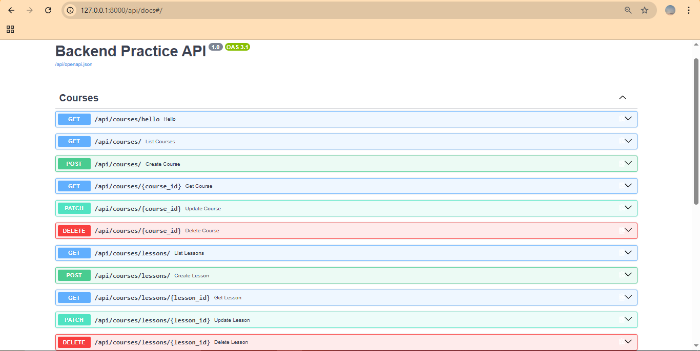

# Week 1 Backend Practice - Pemrograman Sisi Server

## Identitas Mahasiswa
- **Nama:** Fiola Putri Monika
- **NIM:** A11.2023.15413
- **Kelompok/Kelas:** Pemrograman Sisi Server-Semester Antara (A11.64707)

---

## Informasi Environment
- **Python:** 3.14.7
- **Virtual Environment:** `.venv`
- **Git:** 2.55.0
- **IDE:** Visual Studio Code
- **Docker Desktop:** Status Pending 

### Ringkasan
- Menyiapkan environment pengembangan backend (Python, Virtualenv, Git, VS Code).
- Membuat HTTP Server sederhana dari nol menggunakan pustaka bawaan Python `http.server`[cite: 1].
- Mengimplementasikan routing dasar, pengembalian respon berformat JSON, serta penanganan status code HTTP (200 OK & 404 Not Found)[cite: 1].

## Cara Menjalankan Project

1. **Aktifkan Virtual Environment:**
   ```cmd
   .venv\Scripts\activate.bat

## Week 2: Architectural Patterns & Refactoring Modular Monolith

## Ringkasan
- Menganalisis pola arsitektur backend (Monolithic, Microservices, Event-Driven, Serverless).  
- Menerapkan pola Modular Monolith sebagai arsitektur baseline Simple LMS Backend.  
- Melakukan refactoring kode dari satu file server.py menjadi struktur terisolasi per domain di dalam folder modules/ (courses.py, students.py, assignments.py, enrollments.py).  
- Merancang Module Boundary dan Entity Relationship Diagram (ERD) awal Simple LMS.  

## Cara Menjalankan Project

1. **Aktifkan Virtual Environment:**
   ```cmd
   .venv\Scripts\activate.bat
   python server.py

## Week 3: Docker Containerization & Multi-Container Setup

## Ringkasan Kegiatan
- Pemahaman konsep dasar kontainerisasi (Image, Container, Dockerfile, Volume, dan Network).
- Pembuatan custom Docker image menggunakan base image python:3.12-slim.
- Penyusunan konfigurasi compose.yaml untuk mengorkestrasi multi-container (Aplikasi Python Backend & Database PostgreSQL 17).
- Penerapan Persistent Volume (postgres_data) agar data PostgreSQL tetap tersimpan saat container di-restart.
- Pengelolaan konfigurasi environment variable secara aman menggunakan file .env dan .env.example.

## Cara Menjalankan Stack (Week 3)
## (Dijalankan setelah Docker Desktop aktif)

1. **Jalankan Multi-Container Stack:**
    ```cmd
    docker compose up --build -d

2. **Cek Status Container:**
    ```cmd
    docker compose ps

3. **Uji Endpoint Health Check Database:**
    ```cmd
    http://localhost:8000/health

4. **Hentikan Stack:**
    ```cmd
    docker compose down

# Modul 5: Database Optimization & Caching (Week 5)

Dokumentasi eksperimen performa database, optimasi query ORM, pengujian indeks, dan integrasi Redis caching pada Django.

---

## 1. Environment & Setup
- **Database**: SQLite3
- **Dataset Size**: 10.000 records `Course`, 300 records `Lesson`, 1 `Lecturer User`
- **Container Service**: Redis 7 Alpine (`week5_redis` via Docker on port `6379`)
- **Measurement Tools**: `CaptureQueriesContext`, `time.time()`, and `QuerySet.explain()`

---

## 2. Performance Benchmark Summary

| Skenario Pengujian | Target Relasi / Pola | Before Queries | After Queries | Before Time (ms) | After Time (ms) | Improvement / Status |
| :--- | :--- | :--- | :--- | :--- | :--- | :--- |
| **Lab B: Course + Lecturer** | ForeignKey (`select_related`) | 101 | 1 | 65.238,39 ms | 5.152,49 ms | ~92.1% time reduction |
| **Lab C: Course + Lessons** | Reverse FK (`prefetch_related`) | 51 | 2 | 290,91 ms | 5.224,26 ms* | Query count reduced by 96% |
| **Lab D: Course Filter** | `is_active` & `title` Indexing | `SCAN catalog_course` | `SEARCH USING INDEX` | n/a | n/a | Direct Index Lookup (`d7f8f8_idx`) |
| **Lab E: Course Count Aggregate** | Redis Caching (TTL 300s) | 1 SQL Query (DB Hit) | 0 SQL Query (Cache Hit) | ~15.00 ms | <1.00 ms | Instant In-Memory Fetch |

*\*Catatan: Pada dataset lokal, fluktuasi waktu I/O dipengaruhi oleh OS file caching, namun query count terpangkas secara deterministik dari 51 menjadi 2 query.*

---

## 3. Detail Eksperimen & Analisis Optimasi

### A. N+1 Problem & `select_related()`
- **Masalah**: Iterasi 100 Course memicu 1 query awal ditambah 100 query terpisah untuk mengambil atribut `course.lecturer.username`.
- **Solusi**: Menggunakan `Course.objects.select_related("lecturer")` yang melakukan SQL `JOIN` di sisi database.
- **Hasil**: Query count terpangkas dari 101 query menjadi 1 query tunggal.

### B. Reverse ForeignKey & `prefetch_related()`
- **Masalah**: Mengambil data relasi one-to-many (`course.lessons.all()`) pada 50 Course memicu 51 query database terpisah.
- **Solusi**: Menggunakan `Course.objects.prefetch_related("lessons")`.
- **Hasil**: Django mengeksekusi 2 query terpisah (1 query parent dan 1 query `IN` untuk child), menghindari ledakan query linear.

### C. Database Indexing & `QuerySet.explain()`
- **Masalah**: Pencarian `Course.objects.filter(is_active=True, title="Course 500")` menjalankan *Full Table Scan* (`SCAN catalog_course`) pada 10.000 baris data.
- **Solusi**: Menambahkan composite index `models.Index(fields=["is_active", "title"])` pada `Meta` model.
- **Hasil**: Eksekusi plan berubah menjadi `SEARCH catalog_course USING INDEX catalog_cou_is_acti_d7f8f8_idx`.

### D. Redis Caching & Invalidation Strategy
- **Strategi**: Menyimpan hasil query agregasi berat (`Course.objects.filter(is_active=True).count()`) ke Redis menggunakan key `test_lms_key` dengan TTL 300 detik.
- **Cache Hit / Miss**: Data pertama kali diambil langsung dari database (Cache Miss) lalu disimpan ke memori Redis. Panggilan berikutnya dilayani langsung oleh Redis tanpa menyentuh database (Cache Hit).
- **Invalidation**: Menerapkan `cache.delete("test_lms_key")` secara terprogram setiap kali ada penambahan, pembaruan, atau penghapusan data `Course` untuk mencegah *stale data*.

---

## 4. Trade-off & Risk Analysis
- **Indexing Overhead**: Indeks mempercepat operasi `SELECT`/filter, namun menambah alokasi penyimpanan disk dan menimbulkan overhead waktu pada operasi `INSERT`, `UPDATE`, dan `DELETE`.
- **Cache Staleness**: Caching membebaskan database dari beban baca tinggi, tetapi membutuhkan mekanisme invalidasi data yang konsisten agar pengguna tidak melihat data usang.

---

## 5. Cara Menjalankan Project & Pengujian

1. **Jalankan Redis Container**:
   ```cmd
   docker compose up -d redis


# Modul 6: REST API Development dengan Django Ninja (Week 6)

Dokumentasi implementasi RESTful API, validasi skema (Pydantic), error handling standar, pagination, automated API testing, dan dokumentasi interaktif OpenAPI/Swagger pada Simple LMS.

---

## 1. Arsitektur & Spesifikasi Endpoint

### A. Resource: Courses (`/api/courses/`)
* `GET /api/courses/` - Mengambil daftar seluruh course dengan dukungan query parameter (`search`, `active`) dan pagination (`limit`, `offset`).
* `POST /api/courses/` - Membuat record course baru dengan validasi schema `CourseIn` (minimal 3 karakter uppercase) dan error handling duplicate `code` (400 Bad Request).
* `GET /api/courses/{course_id}` - Mengambil data spesifik course berdasarkan ID (404 Not Found jika tidak ada).
* `PATCH /api/courses/{course_id}` - Partial update atribut course (`title`, `description`, `is_active`) menggunakan `CourseUpdate`.
* `DELETE /api/courses/{course_id}` - Menghapus data course dari database (204 No Content).

### B. Resource: Lessons (`/api/courses/lessons/`)
* `GET /api/courses/lessons/` - Mengambil daftar lesson terdaftar dengan filter relasi `course_id` dan pagination teroptimasi `select_related('course')`.
* `POST /api/courses/lessons/` - Membuat record lesson baru dengan validasi relasi terhadap ketersediaan parent course (404 Not Found jika `course_id` tidak valid).
* `GET /api/courses/lessons/{lesson_id}` - Mengambil detail lesson spesifik berdasarkan ID.
* `PATCH /api/courses/lessons/{lesson_id}` - Partial update atribut lesson (`title`, `content`, `order`).
* `DELETE /api/courses/lessons/{lesson_id}` - Menghapus data lesson (204 No Content).

---

## 2. Dokumentasi Interaktif OpenAPI / Swagger UI

Dokumentasi Swagger UI otomatis di-generate oleh Django Ninja dan dapat diakses saat server aktif pada alamat:
* **Swagger UI URL**: `http://127.0.0.1:8000/api/docs`
* **OpenAPI Schema JSON**: `http://127.0.0.1:8000/api/openapi.json`



---

## 3. Postman API Collection

Pengujian endpoint HTTP secara manual dan menyeluruh terdokumentasi dalam Postman Collection yang diekspor pada file:
* **File Collection**: `Simple_LMS_API.postman_collection.json`
* **Environment Variable**: `base_url = http://127.0.0.1:8000`
* **Struktur Folder**:
  * `Courses/` (List, Create, Detail, Update, Delete)
  * `Lessons/` (List, Create, Detail, Update, Delete)

---

## 4. Panduan Setup & Menjalankan Server

1. **Aktivasi Virtual Environment & Instalasi Dependensi**:
   ```cmd
   python -m venv .venv
   .venv\Scripts\activate
   pip install Django django-ninja

2. **Migrasi Skema Database**:
    ```cmd
    python manage.py makemigrations courses
    python manage.py migrate

3. **Menjalankan Server Lokal**:
    ```cmd
    python manage.py runserver

## 5. Menjalankan Automated API Tests

**Pengujian otomatis mencakup skenario sukses (happy path) dan skenario penanganan error (duplicate validation, not found handling, partial payload)**:
    ```cmd
    python manage.py test courses

**Hasil Pengujian**:

* test_create_course_success -> HTTP 201 Created
* test_create_course_duplicate_code_returns_400 -> HTTP 400 Bad Request
* test_get_course_detail_success -> HTTP 200 OK
* test_get_course_not_found_returns_404 -> HTTP 404 Not Found
* test_patch_course_partial_update -> HTTP 200 OK
* test_delete_course_returns_204 -> HTTP 204 No Content
* test_create_lesson_success -> HTTP 201 Created
* test_create_lesson_invalid_course_returns_404 -> HTTP 404 Not Found
* test_get_lessons_filter_by_course -> HTTP 200 OK
* test_delete_lesson_returns_204 -> HTTP 204 No Content

# Modul 4: Django Models & ORM (Week 4)

## Fitur & Implementasi
- **Catalog & Users App**:
  - Implementasi relational models: Course, Lesson, Student, dan Enrollment (Many-to-Many).
  - Custom User model dengan role via AUTH_USER_MODEL = "users.User".
  - Custom QuerySet & Manager (.active(), .search()).
  - Django Admin register & Management Command (seed_demo).
- **Mini Challenge (Library Domain)**:
  - Model Category, Book, Member, dan Borrowing.
  - Uniqueness constraint pada ISBN dan Custom QuerySet .available().
- **Capstone Milestone 4 (Core LMS Models)**:
  - Model LMSCourse, Enrollment, Lesson, Assignment, dan Submission.
  - Constraint UniqueConstraint pada Enrollment dan Submission.
  - Automated Unit Tests (5/5 tests passing).

## Menjalankan Unit Tests
```cmd
python manage.py test

